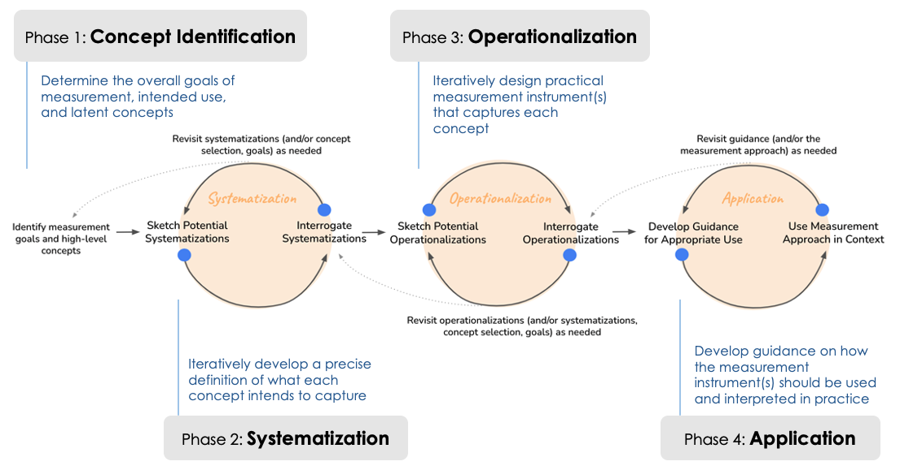

# AI Measurement as a Stakeholder-Engaged Design Practice

## FAccT 2025 Translation Tutorial: AI Measurement as a Collaborative Design Practice 

[Thursday, 26 June 3:15 PM - 4:15 PM in New Stage C](https://programs.sigchi.org/facct/2025/program/session/197054)

[ACM Conference on Fairness, Accountability, and Transparency](https://facctconference.org/2025/)

## Tutorial Structure

* Introduction to measurement in AI
* Overview of concepts, approaches, and tools for supporting measurement as a collaborative design process
* Case studies supporting collaboration for AI measurement 
* Discussion

### Overview

AI systems often fail in deployment due to validity, bias, and value alignment issues. Effectively anticipating these issues requires having effective approaches and tools to *measure* them. However, existing design and evaluation practices often suffer from inappropriate *measurement*  assumptions, made when translating from abstract, unobservable concepts to readily implementable approaches for measuring those concepts. In FAccT 2020, researchers organized a translation tutorial---[The Meaning and Measurement of Bias: Lessons from Natural Language Processing](https://azjacobs.com/measurement)---to introduce the language of measurement modeling to better examine fairness issues in NLP technologies. 
In the five years since, a small but growing body of work in the FAccT community has called for greater *stakeholder participation* in decisions about how to measure concepts like fairness, functionality, or stereotyping. Researchers have begun to explore approaches to support such participation in practice, but efforts remain nascent. Importantly, beyond the context of AI, there are rich, existing traditions of this kind of engagement in the design of quantitative measurement approaches. Research communities---from the social and life sciences to philosophy of science and human-computer interaction---have proposed approaches to support the design and evaluation of measurement instruments for concepts like worker "well-being," community "peace," or "quality" of services. This tutorial will introduce concepts, practices, and tools from these disciplines and demonstrate their applicability to the context of collaborative measurement for evaluation of AI systems, and we will show how stakeholders can be engaged throughout.  Through concrete case studies, we will re-formulate AI measurement as a collaborative design practice that combines AI expertise and non-AI expertise, from the scholarly expertise of social scientists to the lived expertise of impacted communities. We will conclude with a discussion on opportunities for cross-disciplinary collaboration to support future work in this space.

## Organizers

* [Anna Kawakami](https://annakawakami.com/)
* [Su Lin Blodgett](https://sblodgett.github.io/) 
* [Solon Barocas](http://solon.barocas.org/)
* [Alex Chouldechova](https://www.microsoft.com/en-us/research/people/alexandrac/)
* [Abigail Jacobs](https://azjacobs.com/)
* [Emily Sheng](https://ewsheng.github.io/)
* [Jenn Wortman Vaughan](https://www.jennwv.com/)
* [Hanna Wallach](https://www.microsoft.com/en-us/research/people/wallach/)
* [Amy Winecoff](https://cdt.org/staff/amy-winecoff/)
* [Angelina Wang](https://angelina-wang.github.io/)
* [Haiyi Zhu](https://haiyizhu.com/)
* [Ken Holstein](https://www.thecoalalab.com/kenholstein)

## 
